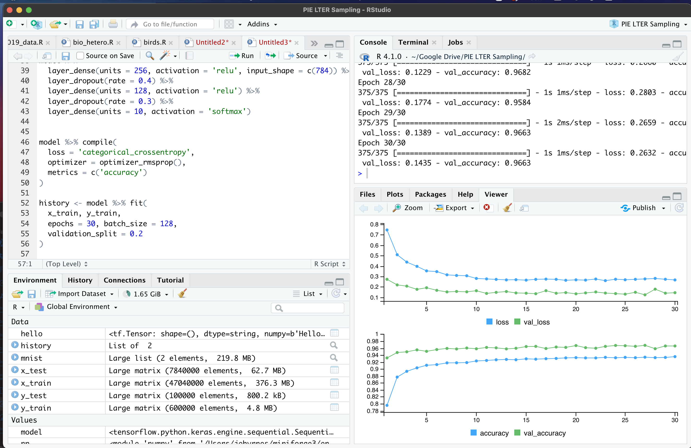

As my third semester of online teaching continued apace, something sad started to happen. My laptop started rebooting at irregular intervals. Then, the keyboard starting coming apart. This was a trusty laptop of 8 years - a delightful Macbook Air that has been my companion through several life transitions. And it would seem, parts for it were no longer made, unless I wanted to buy them aftermarket and fix it myself (still on my list - if I can find the parts!) I was truly sad. 

But.... also secretly delighted? I was doing more and more deep learning and Bayesian work, and the computer was showing its age. In particular, the CNN work I was doing with the [R Tensorflow](https://tensorflow.rstudio.com/) wrapper was starting to heat up. What if, I reasoned to myself after seeing the speed benchmarks, I was able to harness the 6 CPUs and GPU of a Macbook pro for this work? I could do major testing at home before I sent big jobs off to a server. I was excited.

I also should have done a wee bit more research.

As I loaded up R and the requisite libraries the day I got my new hog, and ran the [MNIST demo](https://tensorflow.rstudio.com/guide/keras/).... I got an immediate crash. Every time I tried any tensorflow code, CRASH!

I dug about, and found that it was due to architecture differences. R installs the x86 tensorflow, and..... well while there is a version for M1 computers, it's [on github and not part of the main release](https://github.com/apple/tensorflow_macos).

Heck, R itself is being run via Rosetta, as it's not native to arm64 yet.

Thus began my quixotic quest to make all of this work. I've been posting and cobbling together different resources. I've learned a bit of python (and now know I need to learn more), and finally understand what all of this conda kerfuffle is all about. So. Here is what I have learned. Follow these steps, and it will run. And pretty well. 

I am not 100% sure if it's using my GPU.... if anyone has any comments on that, let me know. The guide below is likely not perfect, might not work for everyone, but, it worked for me? This is distilled from [this thread](https://github.com/rstudio/keras/issues/1165). So, here you go.


1. Go through the instruction to [install Tensorflow on an M1 Mac from here](https://medium.com/codex/installing-tensorflow-on-m1-macs-958767a7a4b3). Note, I called the environment I created `tf_env`.

2. Install one of the arm64 nightly builds at https://mac.r-project.org/ - I'm using 4.1. Oh hey, hi new pipe operator! Or, er, `new_pipe_operator |> hello()`.

3. Install a daily build of Rstudio for OSX from https://dailies.rstudio.com/ so it can handle the new version of R.

4. To test, run Rstudio, and type `version` to make sure your arch is aarch64.

5. OK, in your terminal, run `conda activate tf_env` - or whatever you named your environment for tensorflow in for #1.

6. To open Rstudio from the environment, run `open -na rstudio`

7. Install the keras and tensorflow libraries. BUT - do not run `install_keras()` or `install_tensorflow()` - because you've got it!

8. At the head of your Rscript, include the following:

```
library(tensorflow)
library(keras)

use_python("~/miniforge3/bin/python")
use_condaenv("tf_env")
```

with the later two getting you all good and set. 

And then - boom - it will run! I was never so happy as to see a successful run.




Now, are there likely some problems here? Maybe! I'd love to know, and I will edit the post as any that are relevant updates come in!

I'm also still not certain it's using the GPU. I tried running a CNN on it, watching GPU performance from Activity Monitor, and didn't really see anything. Would be delighted at any thoughts/suggestions about this issue.

But, hey, it runs!